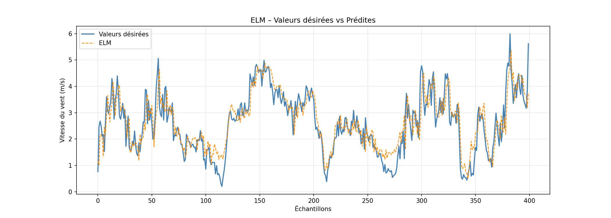
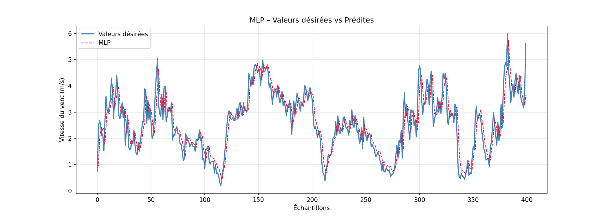
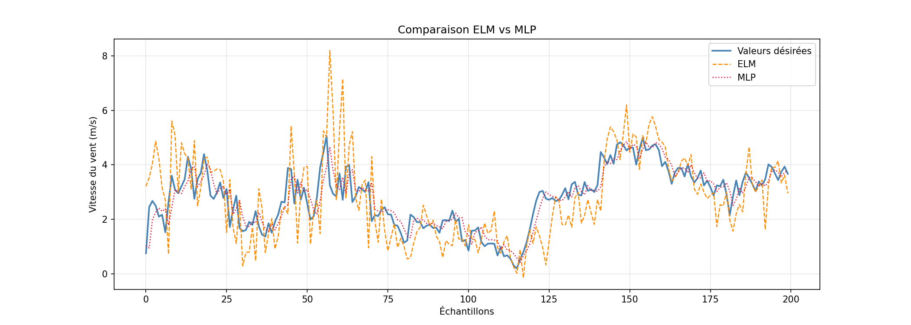
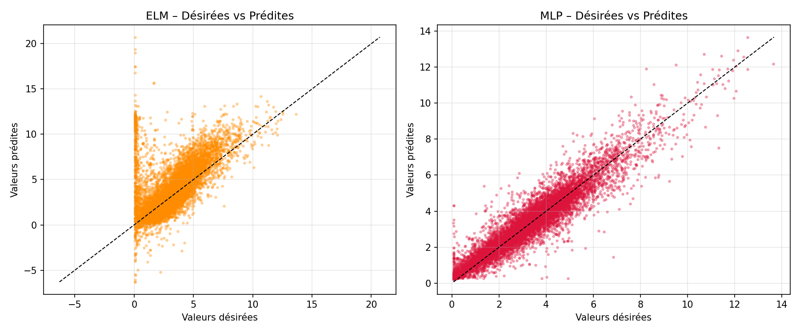

### Hourly Wind Speed Prediction
#### ELM vs MLP - Comparative Study

# 1. Introduction

This practical work aims to build and compare two regression models for hourly wind speed prediction.
The `windSpeedData.txt` dataset contains 52,559 successive wind speed measurements in m/s. The
adopted approach uses a sliding window of 10 past values, from time steps t to t+9, to predict the
future value at time step t+10. This transforms the problem into a supervised regression task.

Two neural network architectures are compared:

- ELM (Extreme Learning Machine): a neural network with one hidden layer whose input weights are
  randomly initialized and fixed; only the output weights are computed analytically using the
  Moore-Penrose pseudo-inverse.

- MLP (Multi-Layer Perceptron): a multi-layer neural network trained by backpropagation with the Adam
  optimizer, using `sklearn.neural_network.MLPRegressor`.

# 2. Dataset and Preprocessing

## 2.1 Dataset Description

| Parameter | Value |
| --- | ---: |
| Total number of measurements | 52,559 |
| Window size (n) | 10 |
| Number of constructed samples | 52,549 |
| Training size (80%) | 42,039 |
| Test size (20%) | 10,510 |
| Split | Chronological (`shuffle=False`) |

## 2.2 Sliding Window Construction

For each index i from 0 to N-11, the following sample is built:

- `X[i] = [data[i], data[i+1], ..., data[i+9]]` with 10 features
- `y[i] = data[i+10]` as the target value

The train/test split is performed chronologically (`shuffle=False`) in order to preserve temporal
causality and avoid any information leakage from the future.

# 3. ELM Model - Extreme Learning Machine

## 3.1 Principle

The ELM is a feedforward neural network with a single hidden layer. Unlike the MLP, the weights `Wi`
between the inputs and the hidden layer, as well as the biases `Bi`, are randomly initialized and never
updated. Only the output weights `beta` are computed analytically:

```text
beta = H+ . y
```

where `H` is the matrix of hidden-layer outputs and `H+` is its Moore-Penrose pseudo-inverse,
computed with `numpy.linalg.pinv`. The activation function used is the sigmoid function:
`f(x) = 1 / (1 + e^-x)`.

## 3.2 ELM Parameters

| Parameter | Value |
| --- | ---: |
| Number of hidden neurons (L) | 100 |
| Activation function | Sigmoid |
| Weight initialization | Uniform `[-1, 1]` |
| Output weight computation | Pseudo-inverse (Moore-Penrose) |
| Convergence time | 1.7905 s |

# 4. MLP Model - Multi-Layer Perceptron

## 4.1 Principle

The scikit-learn `MLPRegressor` implements a multi-layer neural network trained by gradient
backpropagation. The optimization algorithm used is Adam (Adaptive Moment Estimation). The input and
output data are normalized with `StandardScaler` before training in order to speed up convergence.

## 4.2 MLP Parameters

| Parameter | Value |
| --- | ---: |
| Architecture (hidden layers) | (100, 50) |
| Activation function | ReLU |
| Optimizer | Adam |
| Initial learning rate | 0.001 |
| Maximum iterations | 500 |
| Early stopping | Yes (10% validation) |
| Actual number of iterations | 18 |
| Normalization | `StandardScaler` for X and y |
| Convergence time | 3.5373 s |

# 5. Results and Visualizations

## 5.1 Comparative Curves: ELM vs MLP

The figures below compare the desired values, corresponding to the real signal, with the values
predicted by each model on the first 200 samples of the test set.





## 5.2 Scatter Plots: Desired vs Predicted Values

An ideal scatter plot would be aligned with the diagonal line `y = x`. The farther the points are from
this diagonal, the less accurate the model is.



# 6. Evaluation Metrics

Four standard regression metrics are used to evaluate the performance of both models:

| Metric | Formula | Interpretation |
| --- | --- | --- |
| MAE | mean(`|y - y_pred|`) | Mean absolute error (m/s) |
| MSE | mean(`(y - y_pred)^2`) | Mean squared error |
| RMSE | sqrt(MSE) | RMSE in original units (m/s) |
| R^2 | `1 - SS_res / SS_tot` | Coefficient of determination [0, 1] |

## 6.1 Performance Comparison Table

| Metric | ELM | MLP | Best model |
| --- | ---: | ---: | --- |
| MAE (m/s) | 1.7322 | 0.4186 | MLP |
| MSE | 10.2793 | 0.3674 | MLP |
| RMSE (m/s) | 3.2061 | 0.6061 | MLP |
| R^2 | -1.7604 | 0.9013 | MLP |
| Time (s) | 1.7905 | 3.5373 | ELM |

## 6.2 MLP Hyperparameter Exploration

a) Influence of the architecture (hidden layers)

| Architecture | R^2 | RMSE (m/s) |
| --- | ---: | ---: |
| (50,) | 0.8963 | 0.6213 |
| (100,) | 0.8831 | 0.6597 |
| (50, 25) | 0.9012 | 0.6065 |
| (100, 50) * | 0.9013 | 0.6061 |
| (100, 50, 25) | 0.8993 | 0.6123 |

(*) Architecture selected for the final model.

b) Influence of the activation function

| Activation | R^2 | RMSE (m/s) |
| --- | ---: | ---: |
| ReLU * | 0.9013 | 0.6061 |
| Tanh | 0.8988 | 0.6138 |
| Logistic | 0.8898 | 0.6405 |

c) Influence of the learning rate

| Learning rate | R^2 | RMSE (m/s) |
| --- | ---: | ---: |
| 0.1 | 0.6933 | 1.0687 |
| 0.01 | 0.9007 | 0.6082 |
| 0.001 * | 0.9013 | 0.6061 |
| 0.0001 | 0.9002 | 0.6095 |

# 7. Analysis and Conclusion

## 7.1 Result Analysis

The metric analysis highlights major differences between the two models:

ELM: The model obtains an R^2 score of -1.7604, which indicates that it explains the variance of the
signal very poorly. A negative R^2 means that the model is less accurate than a simple prediction based
on the mean. This can be explained by the absence of data normalization and by the random nature of
the input weights, which are not optimized for this high-dimensional signal. The RMSE of 3.2061 m/s
confirms a high prediction error.

MLP: The model obtains an R^2 score of 0.9013, which indicates that it explains 90.1% of the signal
variance. With an RMSE of 0.6061 m/s and an MAE of 0.4186 m/s, the predictions are very close to the
real values. Data normalization and Adam optimization enabled fast convergence in only 18 iterations.

## 7.2 Observed Limitations of the ELM

Although the ELM is known for its fast training, several factors limit its performance on this problem:

1. The random input weights are not adapted to the structure of the wind signal. Without prior
   normalization, the sigmoid activation values saturate, reducing the representation capacity of the
   hidden layer.

2. Computing the pseudo-inverse of a large matrix (42,039 x 100) may introduce numerical
   instabilities.

3. The ELM is better suited to classification than to the regression of continuous and noisy signals such
   as meteorological time series.

## 7.3 Conclusion

| Criterion | ELM | MLP | Winner |
| --- | ---: | ---: | --- |
| Accuracy (R^2) | -1.760 | 0.901 | MLP |
| Error (RMSE m/s) | 3.206 | 0.606 | MLP |
| Error (MAE m/s) | 1.732 | 0.419 | MLP |
| Training time | 1.79 s | 3.54 s | ELM |
| Implementation complexity | Low | Medium | ELM |
| Need for normalization | Not required | Required | ELM |

Based on the obtained results, the MLP (`MLPRegressor`) is clearly the best prediction model for this
time series problem. It obtains an R^2 score of 0.9013 and an RMSE of 0.6061 m/s, compared with an
R^2 score of -1.7604 for the ELM. Although the ELM is faster to train (1.79 s vs 3.54 s) and simpler to
implement, its regression performance on non-normalized temporal data remains insufficient. Thanks to
its iterative backpropagation optimization and data normalization, the MLP produces high-quality
predictions and follows the real wind speed signal closely.
